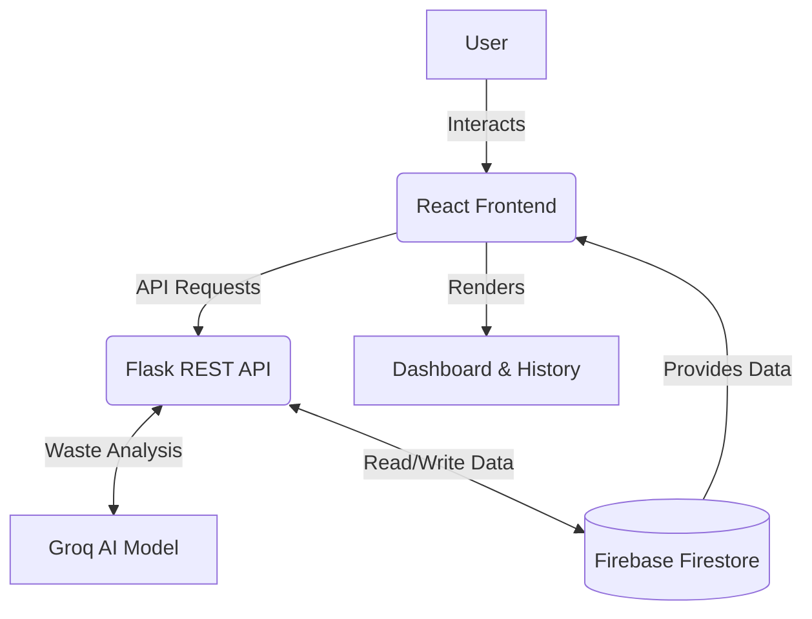
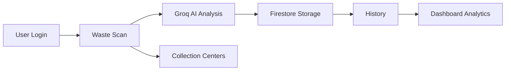

<div align="center">
  

  <h1>🌍 Sustainable Waste Management Assistant Using Generative AI ♻️</h1>
  
  <p>
    An AI-powered smart city sustainability platform that helps users make environmentally responsible waste disposal decisions.
  </p>

<!-- Badges -->
<p>
  
  
  
  
  
  
  
  
  
  
  
</p>
</div>

---

## 📖 Project Overview

**Sustainable Waste Management Assistant Using Generative AI** is an innovative platform aimed at promoting environmental sustainability. By leveraging the power of Groq's LLaMA 3.3-70B Versatile model, this application intelligently analyzes waste items to provide users with accurate disposal, recycling, and hazard guidance. It integrates a rich, responsive interface with interactive maps and data analytics to empower users towards a greener footprint.

---

## 🚀 Live Demo

- **Frontend (Vercel):** [https://sustainable-waste-management-nu.vercel.app/](https://sustainable-waste-management-nu.vercel.app/)
- **Backend (Render):** [https://sustainable-waste-management.onrender.com](https://sustainable-waste-management.onrender.com)


---

## ✨ Features

- 🧠 **AI Waste Classification:** Identify the correct waste category for any item.
- 📋 **Disposal Instructions:** Step-by-step guidance on how to safely dispose of waste.
- ♻️ **Recycling Guidance:** Know what can and cannot be recycled.
- ⚠️ **Hazard Detection:** Flag hazardous materials like e-waste or chemicals.
- 🌱 **Eco-Friendly Suggestions:** Recommendations to reuse and reduce waste.
- 📍 **Nearby Collection Centers:** Interactive map displaying local recycling facilities.
- 🔐 **Firebase Authentication:** Secure login and registration flows.
- 🗄️ **Firestore Scan History:** Persist and review past waste scans.
- 📊 **Analytics Dashboard:** Visualize your waste generation footprint and recycling rates.
- 📱 **Responsive UI:** Fully optimized for both mobile and desktop screens.
- 🌓 **Dark & Light Theme:** Beautifully tailored viewing experiences.
- 🔍 **Search & Filtering:** Easily navigate through collection centers and scan history.

---

## 🛠️ Tech Stack

| Category | Technologies Used |
| :--- | :--- |
| **Frontend** | React.js, Tailwind CSS, Axios, React Router, Chart.js, Leaflet.js |
| **Backend** | Flask, Python, Firebase Admin SDK, Groq API (LLaMA 3.3-70B) |
| **Database** | Firebase Firestore |
| **Authentication** | Firebase Authentication |
| **Deployment** | Vercel (Frontend), Render (Backend) |

---

## 🏗️ Project Architecture



---

## 📂 Folder Structure

```text
Sustainable-Waste-Management/
├── backend/
│   ├── app.py
│   ├── firebase_config.py
│   ├── requirements.txt
│   ├── routes/
│   │   ├── analyze_routes.py
│   │   ├── dashboard_routes.py
│   │   └── ...
│   └── services/
│       ├── ai_service.py
│       └── firestore_service.py
└── frontend/
    ├── index.html
    ├── package.json
    ├── tailwind.config.js
    ├── vite.config.js
    ├── vercel.json
    └── src/
        ├── components/
        ├── contexts/
        ├── pages/
        ├── services/
        └── assets/
```

---

## ⚙️ Installation Guide

### 1. Clone Repository
```bash
git clone https://github.com/Dileep0610/Sustainable-Waste-Management.git
cd Sustainable-Waste-Management
```

### 2. Backend Setup
```bash
cd backend
python -m venv venv
source venv/bin/activate  # On Windows: venv\Scripts\activate
pip install -r requirements.txt
```

### 3. Frontend Setup
```bash
cd ../frontend
npm install
```

### 4. Run the Application
**Backend:**
```bash
cd backend
flask run --host=0.0.0.0 --port=5000
```
**Frontend:**
```bash
cd frontend
npm run dev
```

---

## 🔐 Environment Variables

<details>
<summary><b>Frontend (.env)</b></summary>

| Variable | Description |
| :--- | :--- |
| `VITE_API_URL` | Your Flask Backend URL |
| `VITE_FIREBASE_API_KEY` | Firebase API Key |
| `VITE_FIREBASE_AUTH_DOMAIN` | Firebase Auth Domain |
| `VITE_FIREBASE_PROJECT_ID` | Firebase Project ID |
| `VITE_FIREBASE_STORAGE_BUCKET` | Firebase Storage Bucket |
| `VITE_FIREBASE_MESSAGING_SENDER_ID`| Firebase Messaging Sender ID |
| `VITE_FIREBASE_APP_ID` | Firebase App ID |
| `VITE_FIREBASE_MEASUREMENT_ID` | Firebase Measurement ID |

</details>

<details>
<summary><b>Backend (.env)</b></summary>

| Variable | Description |
| :--- | :--- |
| `GROQ_API_KEY` | API key for the Groq AI service |
| `FIREBASE_CREDENTIALS` | Stringified Firebase Service Account JSON (Render) |
| `FLASK_APP` | Entry point for the Flask application |
| `FLASK_ENV` | Development or Production |
| `CORS_ORIGIN` | Allowed origin for CORS (e.g., Vercel URL) |

</details>

---

## 📡 API Endpoints

| Method | Endpoint | Description |
| :--- | :--- | :--- |
| `POST` | `/api/analyze-waste` | Processes waste item via Groq AI |
| `POST` | `/api/save-history` | Saves the scan result to Firestore |
| `GET`  | `/api/get-history` | Retrieves a user's scan history |
| `GET`  | `/api/get-centers` | Returns nearby collection centers |
| `GET`  | `/api/dashboard-data`| Aggregates user metrics for the dashboard |

---

## 🔄 Workflow



---

## 🔮 Future Enhancements

- 📷 **Image-based waste detection:** Upload a photo for instant classification.
- 📲 **QR code scanning:** Quickly identify products and packaging.
- 🗺️ **GPS-based routing:** Directions to the nearest recycling centers.
- 🌍 **Carbon footprint calculator:** Track CO2 saved by recycling.
- 🤖 **AI Chatbot:** Real-time conversational assistant for sustainability.
- 🎙️ **Voice Assistant:** Hands-free waste queries.
- 🎮 **Gamification:** Earn points and badges for eco-friendly habits.
- 🌐 **Multi-language support:** Accessibility across different regions.
- 🔔 **Push Notifications:** Reminders for garbage collection days.
- 👑 **Admin Dashboard:** Monitor platform usage and data.

---

## 🚧 Challenges Faced

During development, several complex engineering challenges were overcome:
- **Prompt Engineering:** Fine-tuning the Groq LLaMA 3.3 model to ensure responses matched a strict, structured JSON schema.
- **Firebase Authentication & Firestore:** Seamlessly linking authenticated users to their scan histories and dashboard data securely.
- **Deployment Issues:** Managing Python environments on Render and SPA routing on Vercel.
- **CORS Configuration:** Ensuring secure, uninterrupted communication between the React frontend and Flask backend.
- **Environment Variables:** Safely injecting and managing secrets across multiple deployment platforms.
- **Responsive UI Design:** Ensuring maps and charts scaled elegantly from mobile viewports up to large desktop monitors.

---

## 📚 Learning Outcomes

Through this capstone project, I acquired comprehensive experience in:
- Building end-to-end full-stack applications integrating modern AI models (Groq/LLaMA).
- Designing RESTful APIs with Flask and efficiently handling asynchronous tasks in React.
- Implementing robust data visualization architectures using Chart.js and interactive geospatial data with Leaflet.js.
- Mastering environment configuration and CI/CD deployment pipelines on Vercel and Render.
- Enhancing UI/UX with Tailwind CSS, supporting theming, and responsive design paradigms.

---

## 🙌 Acknowledgements

Special thanks to the phenomenal tools and platforms that made this possible:
- [Groq](https://groq.com/) for lightning-fast AI inference
- [Firebase](https://firebase.google.com/) for backend-as-a-service excellence
- [React](https://reactjs.org/) & [Flask](https://flask.palletsprojects.com/)
- [OpenStreetMap](https://www.openstreetmap.org/) & [Leaflet.js](https://leafletjs.com/)
- [Chart.js](https://www.chartjs.org/)

---

## 📄 License

This project is licensed under the [MIT License](LICENSE).

---

## 👨‍💻 Author

**Kothakota Dileep Kumar**  
*AI & Full Stack Developer*  

🔗 **GitHub:** [https://github.com/Dileep0610](https://github.com/Dileep0610)  
💼 **LinkedIn:** [https://www.linkedin.com/in/dileep0610/](https://www.linkedin.com/in/dileep0610/)  
📧 **Email:** [kottakotadileepkumar5@gmail.com](mailto:kottakotadileepkumar5@gmail.com)

---

<div align="center">
  <b>⭐ If you found this project useful, please give it a Star on GitHub! ⭐</b>
</div>
